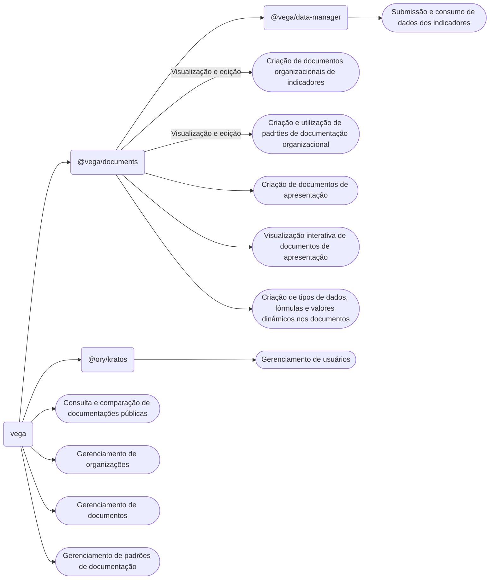

# vega

Aplicação de coleta, análise, tratamento, armazenamento e distribuição de indicadores de governança nestas instituições

```mermaid
flowchart LR
    vega("vega") --> documents("@vega/documents")
    vega --> kratos("@ory/kratos")
    documents --> datamanager("@vega/data-manager")

    documents   -->|Visualização e edição| us1([Criação de documentos organizacionais de indicadores])
    documents   -->|Visualização e edição| us2([Criação e utilização de padrões de documentação organizacional])
    documents   --> us3([Criação de documentos de apresentação])
    documents   --> us4([Visualização interativa de documentos de apresentação])
    documents   --> us5([Criação de tipos de dados, fórmulas e valores dinâmicos nos documentos])
    datamanager --> us6([Submissão e consumo de dados dos indicadores])
    vega        --> us7([Consulta e comparação de documentações públicas])
    kratos      --> us8([Gerenciamento de usuários])
    vega        --> us9([Gerenciamento de organizações])
    vega        --> us10([Gerenciamento de documentos])
    vega        --> us11([Gerenciamento de padrões de documentação])
```
